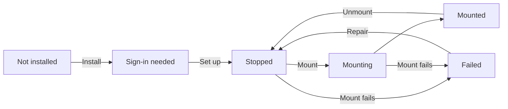

# Filen for Omarchy

[](https://github.com/CatalinGB/omarchy-filen/actions/workflows/ci.yml)

An Omarchy-native integration for [Filen](https://filen.io) — end-to-end
encrypted cloud storage. A bar widget and panel show your mount status, storage
usage, and recent files; your Filen drive mounts as an ordinary folder. Built on
the [filen-rs](https://github.com/FilenCloudDienste/filen-rs) `filen` CLI.



The plugin installs everything it needs: the `filen` binary, rclone, and its
systemd units. You log in once, and it starts at login.

> **Beta.** `filen-rs` is a public beta. This plugin pins a known-good `filen`
> version and updates it deliberately — currently **0.2.9** (a pre-release),
> because 0.2.8 panics on mount. See
> [docs/supported-environments.md](docs/supported-environments.md).

## Requirements

- Omarchy 4 (Quattro shell plugin system)
- `systemd` 256+ (for `systemd-creds --user`)
- `python3` and `fuse3` (both ship with Omarchy; used for the status helper and
  the mount respectively)
- x86_64 or aarch64 (gnu or musl)

The plugin detects anything missing and offers to install it. The full matrix —
plus the pinned `filen` 0.2.9 / rclone 1.74.2 versions — is in
[docs/supported-environments.md](docs/supported-environments.md).

> **Known limitations.** Filen appears as a **mount, not a sync client** (no
> offline copy; the RAM cache is lost on reboot), it is **single-account**, and
> the CLI exposes **no plan data**. The pinned `filen` is a pre-release. See
> [docs/troubleshooting.md](docs/troubleshooting.md#known-limitations).

## Install

```bash
omarchy plugin add https://github.com/CatalinGB/omarchy-filen.git --enable
```

Omarchy clones the repository into
`~/.config/omarchy/plugins/io.github.catalingb.filen/`, validates it, and adds
the bar icon. Plugins run unsandboxed with your user permissions — review the
source before accepting the prompt.

**Upgrading from an earlier checkout?** The plugin id changed from
`filen.storage` to `io.github.catalingb.filen`, so it is a different install.
Remove the old one first (`omarchy plugin update` cannot cross an id rename):

```bash
"$HOME/.config/omarchy/plugins/filen.storage/bin/setup" --uninstall
omarchy plugin remove filen.storage
```

Then install as above. Your encrypted credential is reused.

## Set up (once)

Setting up Filen is two steps. Click the Filen icon in the bar:

1. **Install Filen** (shown first) — downloads the pinned `filen` binary,
   pre-seeds rclone, and writes and loads the systemd units.
2. **Set up Filen** — opens a terminal and walks you through signing in to Filen
   (email / password / two-factor). That credential is encrypted into a
   machine-bound **systemd credential** and the plaintext is shredded.

Once **Set up** finishes, the drive is enabled to mount at login and is mounted
immediately. From then on it comes up at login — **no repeated login**, and no
password is ever typed into the panel.

## Using the panel

- **Status** — mounted, mounting, stopped, sign-in needed, or failed.
- **Storage** — used and total, with a percentage.
- **Recent files** — your most recent Filen items; click one to open it in
  Nautilus.
- **Mount / Unmount** — control the mount for this session.
- **Mount at login** — toggle automatic mounting.
- **Settings** — the cogwheel (top-right) opens a full configuration view.
- **Open from the menu (optional)** — merge
  [`contrib/omarchy-menu-filen.jsonc.example`](contrib/omarchy-menu-filen.jsonc.example)
  to add web / terminal / mount entries to the Omarchy menu.

The bar icon shows the state that most needs attention (failed → sign-in needed →
stopped → mounted), so problems surface without opening the panel.

## Settings

Click the **cogwheel** (top-right of the panel) to open the Settings view: mount
folder, cache limit, refresh cadences, the bar label, whether recent files
appear, and **Reset to defaults**. Each change is written to the plugin's own
entry in `~/.config/omarchy/shell.json` and takes effect immediately; Back or
**Esc** returns to the status view.

| Setting | Default | Notes |
|---|---|---|
| Mount folder | `~/Filen` | Where Filen appears; changing it restarts the mount |
| Cache size limit | 4 GB | Upper bound on the RAM-backed VFS cache (see below); changing it restarts the mount |
| Status refresh | 15 s | Local-only check; cheap |
| Storage/recents refresh | 10 min | Network calls; keep it slow |
| Show text in bar | off | Prints state next to the icon |
| Show recent files | on | Hide the recents list (e.g. when Filen is used mainly for backup) |

You can also edit the entry directly in `~/.config/omarchy/shell.json`.
Changing **Mount folder** or **Cache size limit** rewrites
`~/.config/omarchy-filen/settings.conf` and restarts the mount; the other
settings take effect on the next poll.

## Where things live

| Path | What |
|---|---|
| `~/Filen/` | Your mounted Filen drive |
| `~/.config/credstore.encrypted/filen-auth` | The encrypted credential (the only persistent copy) |
| `~/.local/share/omarchy-filen/` | The managed `filen` binary and rclone |
| `~/.local/share/omarchy-filen/filen.version` | Version marker for the managed `filen` binary |
| `~/.config/omarchy-filen/settings.conf` | Live mount settings (mount folder, cache limit) |
| `~/.config/systemd/user/omarchy-filen-mount.service` | The mount unit |
| `~/.config/systemd/user/filen-status.{timer,service}` | The slow status/recents timer |
| `$XDG_RUNTIME_DIR/filen/` | tmpfs: mount point config, `rclone.conf`, VFS cache, status |
| `~/.config/omarchy/shell.json` | Bar layout and plugin settings |

**The config directory is tmpfs**, so `rclone.conf` (which contains your Filen
keys) never touches persistent disk. The trade-off: the file cache lives in RAM
and is lost on reboot, so cached files are not available offline across restarts.
See [SECURITY.md](SECURITY.md).

## Using it from the terminal

Helpers stay inside the installed plugin rather than modifying your `PATH`:

```bash
PLUGIN="$HOME/.config/omarchy/plugins/io.github.catalingb.filen"

"$PLUGIN/bin/setup"                       # install / repair / re-provision
"$PLUGIN/bin/setup" provision             # sign in and store the credential
"$PLUGIN/bin/setup" update                # refresh the pinned filen binary and units
"$PLUGIN/bin/status"                      # the panel's JSON
systemctl --user status omarchy-filen-mount.service
systemctl --user restart omarchy-filen-mount.service
journalctl --user -u omarchy-filen-mount.service -f
```

## Open from the Omarchy menu (optional)

Merge [`contrib/omarchy-menu-filen.jsonc.example`](contrib/omarchy-menu-filen.jsonc.example)
into `~/.config/omarchy/extensions/omarchy-menu.jsonc` to add Filen entries
(web, terminal, mount/unmount) to the menu.

## Troubleshooting

- **Sign-in needed** — your credential is missing or was rejected (often after a
  password change). Run **Set up** again.
- **Mount failed** — `journalctl --user -u omarchy-filen-mount.service`. A stale FUSE
  mount is cleaned automatically on the next start.
- **Bar icon dim** — the service is stopped; use **Mount**.
- **Filen shows unavailable** — check `systemd-creds` support (`systemd-creds
  --version`) and that FUSE is installed.

The full state → cause → action matrix (needs-auth, failed, offline/stale quota,
RAM cache, stale FUSE, credential errors) is in
[docs/troubleshooting.md](docs/troubleshooting.md).

## Uninstall

```bash
PLUGIN="$HOME/.config/omarchy/plugins/io.github.catalingb.filen"
"$PLUGIN/bin/setup" --uninstall        # removes units; keeps your credential
"$PLUGIN/bin/setup" --uninstall --purge # also deletes the credential
omarchy plugin remove io.github.catalingb.filen
```

Uninstalling never touches anything stored in Filen.

## Docs

- [docs/supported-environments.md](docs/supported-environments.md) — supported
  platforms, required tools, architectures, pinned versions, and the beta caveat.
- [docs/troubleshooting.md](docs/troubleshooting.md) — the state → cause → action
  matrix and known limitations.
- [docs/verification.md](docs/verification.md) — the automated suites and the
  live end-to-end checklist (`tests/e2e/live.sh`).
- [docs/vm-testing.md](docs/vm-testing.md) — running that live checklist on a
  fresh Omarchy in QEMU/KVM.
- [docs/status-contract.md](docs/status-contract.md) — the status JSON and CLI
  invocation contract the panel consumes.
- [docs/prerequisites.md](docs/prerequisites.md) — what the plugin installs and
  who owns it.
- [docs/architecture.md](docs/architecture.md) — component and provisioning
  diagrams.
- [docs/pin-maintenance.md](docs/pin-maintenance.md) — how to bump the pinned
  `filen`/rclone versions, and what `setup doctor` reports.
- [docs/release.md](docs/release.md) — the versioning/release runbook.
- [docs/upstream-filen-rs-0.2.8-mount-panic.md](docs/upstream-filen-rs-0.2.8-mount-panic.md)
  — the draft upstream issue for the 0.2.8 mount panic.
- [CONTRIBUTING.md](CONTRIBUTING.md) — dev setup, tests, and conventions.
- [SECURITY.md](SECURITY.md) — the security model.

## License

See [LICENSE](LICENSE).
