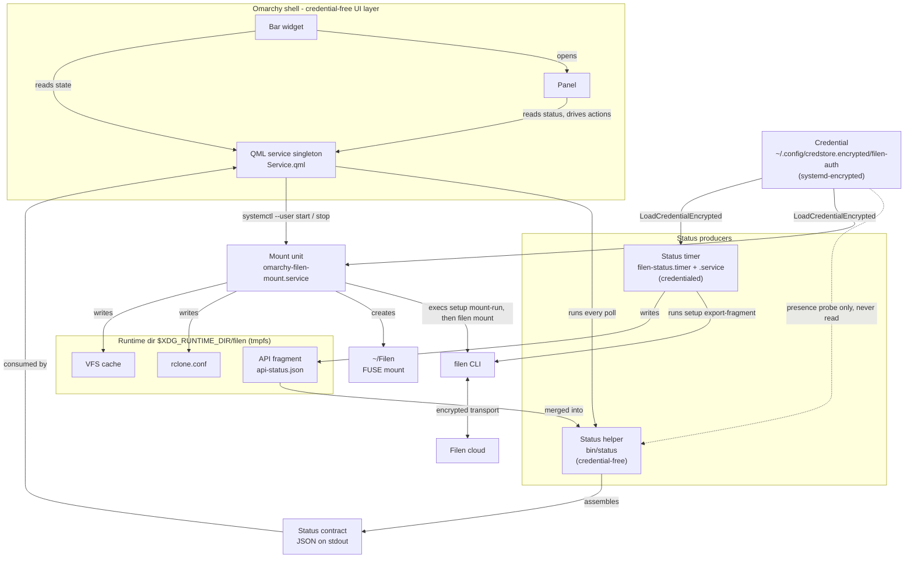
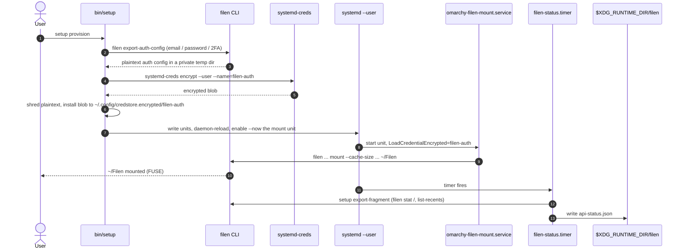

# Architecture

How the plugin is put together: a credential-free UI layer in the shell, two
status producers, and a systemd-supervised Filen mount. The diagrams below are
the fastest way in; the prose is deliberately thin.

## Components and data flow

The Bar widget opens the Panel; both read the QML service singleton, which is
the only thing that polls. The service runs the **credential-free** Status helper
and drives the systemd units. The **credentialed** Status timer writes the API
fragment, and the two systemd units receive the encrypted Credential through
`LoadCredentialEncrypted=`.

## Provisioning and authentication

Provisioning is one-time and interactive: the plaintext auth config exists only
long enough to be encrypted, then is shredded. Each unit decrypts the blob into
its own RAM credentials directory at start.

See [status-contract.md](status-contract.md) for the status document,
[prerequisites.md](prerequisites.md) for who owns each piece, and
[SECURITY.md](../SECURITY.md) for the credential model.
